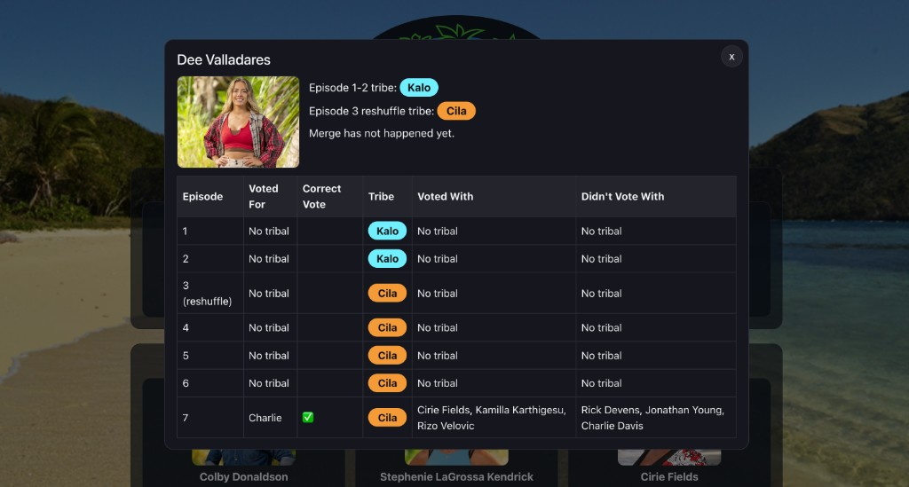

# Fantasy Survivor 50

Interactive fantasy draft tracker for Survivor Season 50: In the Hands of the Fans.

## Live URL

[https://fantasysurvivor50.surge.sh](https://fantasysurvivor50.surge.sh)

## What It Does

Eight friends each drafted three Survivor contestants. This site tracks the season as it plays out:

- **Team Board** — All 24 contestants are displayed in a grid, grouped by the person who drafted them. Eliminated players are marked with a black X overlay.
- **Player Details** — Click any contestant card to open a detailed profile showing:
  - Their photo and tribe assignments (original + post-reshuffle)
  - An episode-by-episode voting table
  - Whether their vote was correct (✅ voted for the person eliminated, ❌ otherwise)
  - Who they voted with and who they didn't vote with on their tribe
  - Table rows stop after a player is voted out or evacuated

## Screenshots

### Team Board


### Player Details Dialog



## Local Development

```bash
npm install
npm run dev
```

## Build & Preview

```bash
npm run build
npm run preview
```

## Deploy (Surge)

```bash
npm run build
surge ./dist fantasysurvivor50.surge.sh
```

## Tech Stack

- React + TypeScript
- Vite
- CSS
- Deployed on Surge
